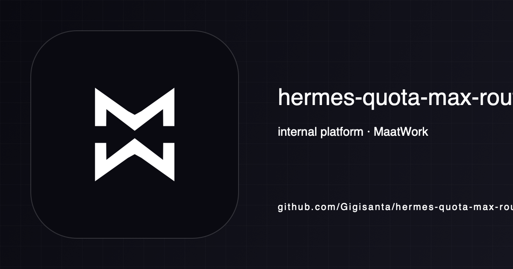

<!-- maatwork-brand:maatwork-mw-20260901 -->
<p align="center"></p>

> internal platform de MaatWork

# Hermes QuotaMax Router 1.0

Router editorial de costo **$0** para MaatWork. Sólo envía fuentes públicas y borradores editoriales a modelos de API gratuitos **verificados en la cuenta**. Si no hay capacidad, guarda el trabajo en SQLite y responde `202`; un worker lo reintenta. No hay respuestas simuladas, pago de emergencia ni fallback a la GPU local.

## Estado y alcance

El servicio arranca en `127.0.0.1:8123`. Arrancar no lo vuelve productivo: cada carga requiere adopción explícita tras el piloto y, en su primera petición productiva, **cuatro proveedores independientes** (tres de rotación y uno de reserva), dos opciones para autor/revisor y una cuota diaria total de al menos 2× el pico medido. La activación se registra en Redis persistente. Si después baja la reserva, el router avisa y sigue probando los proveedores gratuitos todavía aptos; encola al agotarse todos. Cada modelo necesita evidencia vigente de precio cero, cuenta sin facturación, cuotas reales, smoke y evaluación editorial. Una entrada inválida se muestra en `/v1/router/status` pero no enruta.

Freebuff **no** es un backend: [sus términos](https://freebuff.com/terms-of-service) limitan el uso gratuito a interacciones humanas en la app. GLM-5.3-Flash es [pago vía API](https://docs.z.ai/guides/overview/pricing). El catálogo de [Free-LLM](https://github.com/nejib1/Free-LLM) sirve para descubrir candidatos, nunca para autorizar precios o cuotas.

## Instalación local

```sh
python3.11 -m venv .venv
.venv/bin/python -m pip install -e '.[dev]'
# Exportar variables del almacén del proyecto antes de servir; no usar keys de otros proyectos.
.venv/bin/quotamax status
.venv/bin/quotamax serve
```

La aplicación no lee archivos `.env` por sí sola. Usá `~/.hermes/project-env/HerMaatOS/work/hermes-quota-max-router/` para las claves propias y exportalas al proceso de forma segura. `.env.example` enumera **nombres**, nunca valores. Necesita Redis local con AOF activado, `appendfsync always` y `maxmemory-policy noeviction`, una sola instancia de Uvicorn y espacio para `var/queue.sqlite3` (modo `0600`). Si Redis cae o pierde esas garantías, la cola sigue aceptando trabajos pero no hay inferencia: un reinicio no puede borrar reservas de cuota y habilitar consumo de más. No expongas `:8123` fuera de loopback.

### Servicio persistente en este Mac

Con los cambios revisados y confirmados en un commit, `scripts/install_service.py` instala un snapshot de ese commit en `~/.hermes/services/free-router/releases/<sha>`, crea un entorno Python propio y registra `com.hermaat.free-router` en launchd. Guarda la cola y el catálogo fuera del checkout. En la primera instalación crea tres tokens distintos de cliente y las rutas de estado en `~/.hermes/project-env/HerMaatOS/work/hermes-quota-max-router/.env` con modo `0600`; las claves de proveedores se agregan allí sólo después de cada alta legítima. La lectura del archivo no ejecuta shell y el plist no contiene secretos.

```sh
.venv/bin/python scripts/install_service.py install
curl -fsS http://127.0.0.1:8123/health
curl -fsS http://127.0.0.1:8123/v1/router/status
launchctl print gui/$(id -u)/com.hermaat.free-router
```

El instalador requiere Python 3.11.4 o posterior, Redis sano y el puerto libre. Comprueba que el proceso arrancó desde el commit instalado con los tres tokens de cliente y rutas de estado absolutas; revierte el plist si falla. Al actualizar conserva las claves existentes y agrega las rutas o tokens faltantes. Si un archivo privado anterior usa rutas relativas, se detiene para migrarlas explícitamente antes de mover la cola. En la primera instalación también rechaza un archivo previo que ya tenga cargas activas o modo piloto, para revisar esa adopción antes de arrancar el servicio. La instalación inicial escribe `ROUTER_PRODUCTION_WORKLOADS=` y `ROUTER_PILOT_MODE=0`: el proceso puede servir salud y déficit de reserva, pero ninguna carga editorial se considera adoptada. Tras superar **todas** las compuertas del piloto, actualizá la lista de cargas en el archivo privado y reiniciá con `launchctl kickstart -k gui/$(id -u)/com.hermaat.free-router`. El mismo comando de instalación despliega otro commit sin rotar los tokens existentes.

## Admisión de proveedores

1. Crear una única cuenta legítima por proveedor con MaatWork; no añadir tarjeta, crédito ni recarga automática. Verificar que las condiciones permiten API automatizada para contenido editorial público. [Gemini Free](https://ai.google.dev/gemini-api/terms) puede usar entradas y respuestas para mejorar productos y prohíbe enviar información sensible o confidencial: no se le envía chat, información personal ni borradores bajo embargo o confidenciales.
2. Guardar la clave en el almacén del proyecto. Registrar en `var/verified-models.json` cada modelo con precio cero y URL oficial, cuota exacta de esa cuenta por minuto/día, contexto, fecha de comprobación, smoke real, evaluación editorial y cargas autorizadas. El archivo de ejemplo es intencionalmente inválido. Para SimpleLLM, registrar además `rph` y `tph` comprobados en la cuenta: el router reserva atómicamente esas ventanas horarias y las incluye al calcular la capacidad diaria. Coordina una sola solicitud SimpleLLM en curso entre procesos mediante Redis, una cota conservadora mientras el límite efectivo de concurrencia de la cuenta no esté verificado. Para Cloudflare, añadir `daily_neurons` y las tasas oficiales `neurons_per_million_input/output`; no seleccionar modelos que requieran Workers Paid.
3. Registrar en `var/daily-peak.json` los picos diarios y la máxima reserva de tokens por petición medidos en el piloto (ver [docs/PILOT.md](docs/PILOT.md)). `quotamax status` muestra el margen de capacidad y los motivos que impiden activar cada carga. Las atestaciones vencen a los siete días: el servicio falla cerrado hasta renovarlas.
4. `quotamax audit` extrae nombres del directorio Free-LLM como entradas **sin verificar** y reserva cuota para hacer una petición real mínima a cada modelo admitido. Comprueba acceso y una afirmación editorial simple; el reporte guarda sólo resultados, sin texto. El servicio repite la auditoría cada 24 horas. Esa prueba de humo **no** sustituye la evaluación de 60/50 casos ni confirma precio, cuota o facturación. Esos datos deben verificarse en las fuentes oficiales y en la cuenta antes de registrar cada modelo; la atestación vence a los siete días. El directorio Free-LLM nunca autoriza modelos por sí mismo, aun si muestra un precio gratuito.
5. Tras superar los siete días, la revisión editorial, USD 0 facturados y la reducción de GPU, agregar sólo las cargas aprobadas a `ROUTER_PRODUCTION_WORKLOADS` (separadas por comas) y reiniciar el servicio. La primera petición no piloto aún exige la reserva completa y registra su activación duradera. Quitar una carga de esa variable la desactiva sin borrar su cola. `/v1/router/status` distingue adopción/activación de salud actual de la reserva.

La cuota diaria se divide según los picos medidos de los tres proyectos, con al menos una cuarta parte reservada a Cactus por su plazo. La disponibilidad descuenta tanto solicitudes como tokens y, en Cloudflare, Neurons. Ante agotamiento, el próximo intento se programa para el reinicio de la ventana de cuota o el `Retry-After` aplicable.

Proveedores candidatos independientes para las cargas editoriales: [Gemini Free](https://ai.google.dev/gemini-api/docs/pricing), [Groq Free](https://console.groq.com/docs/rate-limits), [Cloudflare Workers AI Free](https://developers.cloudflare.com/workers-ai/platform/pricing/), [SiliconFlow Free](https://docs.siliconflow.cn/docs/userguide/faqs/rate-limit-and-upgradation), [SimpleLLM Free](https://simplellm.eu/docs/models.html) y [Vikasit Nova](https://vikasit.ai/inference). MaatWork ya tiene claves dedicadas de Gemini y SimpleLLM: `gemini-3.5-flash-lite` y `gemma-4-E4B` pasaron pruebas sintéticas a precio cero con las cuotas de cuenta comprobadas, pero su aptitud editorial sigue pendiente. SiliconFlow exige verificación de identidad. Vikasit publica un cupo gratuito diario, pero su acceso devolvió 502 el 25 de septiembre y sus términos figuran como plantilla pendiente de revisión. El router sólo acepta su modelo `vikasit-nova` y nunca más de 2 millones de tokens diarios declarados; los demás modelos de Vikasit tienen precio positivo. Cada candidato debe pasar la verificación de cuenta, cuota y calidad por carga; figurar aquí no lo habilita. [OpenRouter](https://openrouter.ai/terms) queda excluido: la cláusula 7(4) prohíbe usar su servicio para desarrollar uno competidor, y este router compartido podría estar alcanzado. No se abrirá cuenta ni se enviarán peticiones desde el router salvo autorización escrita específica del operador. [Cerebras](https://www.cerebras.ai/inference) anuncia un crédito inicial de prueba y por eso no cuenta como cuarto proveedor. En Cloudflare el modelo tiene precio por Neuron fuera del cupo, pero el plan Free se detiene al agotarse: sólo cuenta el cupo de 10.000 Neurons diarios sin facturación y la cuota real que confirme la cuenta. La auditoría debe comprobar también que el modelo sigue disponible en Workers Free. Créditos temporales no cuentan como capacidad permanente.

[Z.ai](https://docs.z.ai/legal-agreement/terms-of-use) queda excluido de estas cargas porque sus términos incluyen una restricción sobre *news reporting* e inversión. [Mistral Free](https://docs.mistral.ai/admin/billing-usage/subscriptions) proporciona un uso mensual incluido que se consume contra precios por modelo; no se admite como tarifa cero. [SambaNova Free](https://cloud.sambanova.ai/plans) exige método de pago y compra de créditos para las primeras peticiones, así que tampoco cuenta como reserva gratuita. Si cambian los términos o el precio, se vuelve a evaluar antes de habilitarlos.

## API

Cada proyecto tiene su token de servidor `ROUTER_TOKEN_JOURNAL`, `ROUTER_TOKEN_SIMON_NEWS` o `ROUTER_TOKEN_CACTUS_BRIEF`. El cliente usa el mismo valor como Bearer. Sólo se acepta `model: "auto"`, texto y respuestas no streaming.

```sh
curl http://127.0.0.1:8123/v1/chat/completions \
  -H "Authorization: Bearer $MAAT_FREE_ROUTER_TOKEN" \
  -H 'X-Maat-Workload: journal' \
  -H 'X-Maat-Stage: author' \
  -H 'X-Maat-Data-Class: public_editorial' \
  -H 'Content-Type: application/json' \
  -d '{"model":"auto","messages":[{"role":"user","content":"Resumí esta fuente pública: ..."}],"max_tokens":500}'
```

`200` incluye `router.provider`, `router.model`, `router.job_id`, `usage` y contenido real. Para la etapa `reviewer`, enviar `X-Maat-Author-Provider` y `X-Maat-Author-Job` con los valores efectivos de la respuesta del autor; el router consulta su trabajo completado, comprueba esa identidad y excluye el proveedor. `202` incluye `id`, `Retry-After` y `Location`; consultar `GET /v1/jobs/{id}` con el mismo token/carga. El resultado completado del trabajo también incluye `router.job_id`. `GET /health`, `/v1/models` y `/v1/router/status` muestran salud, modelos admitidos y déficit de reserva. `GET /v1/router/metrics` informa eventos agregados, cola y trabajos únicos aceptados por día UTC y carga (`daily_requests`), incluidos pendientes; cada fila informa `planned_token_samples` y `max_planned_tokens` sin contenido ni secretos. El servidor rechaza patrones evidentes de datos personales y peticiones mayores a 128 KiB, y los adaptadores deben admitir sólo fuentes públicas y borradores editoriales. La cola no registra contenido en logs, conserva pendientes hasta completarlos y purga resultados completados después de siete días.

Para una calibración no publicable con menos de cuatro proveedores, iniciar con `ROUTER_PILOT_MODE=1` y mandar `X-Maat-Pilot: true`. Nunca activar ese modo en una ruta de publicación. Al desactivar la variable, los trabajos piloto pendientes quedan suspendidos en cola aunque esa carga esté adoptada en producción. La publicación de cada proyecto mantiene sus propios gates.

## Verificación

El procedimiento de comparación de siete días y sus criterios de adopción están en [docs/PILOT.md](docs/PILOT.md). El estado de altas y reserva al 2026-09-24 está en [docs/PROVIDER-STATUS.md](docs/PROVIDER-STATUS.md).

```sh
make lint type-check test
```

Las pruebas usan Redis falso con Lua y HTTP simulado; no consumen cuota ni tocan producción. El código anterior se conserva sólo en historial Git. No usar sus scripts, catálogos, LiteLLM, Gradio ni endpoints de `:8088`.
